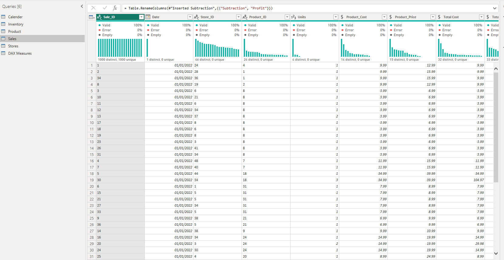
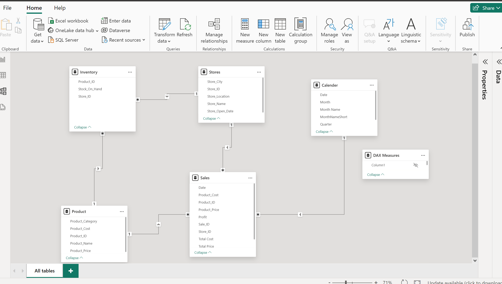
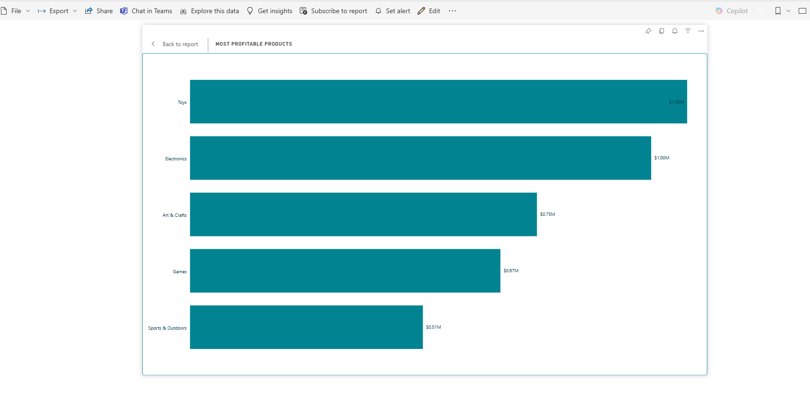
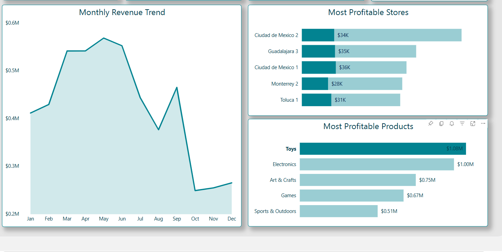
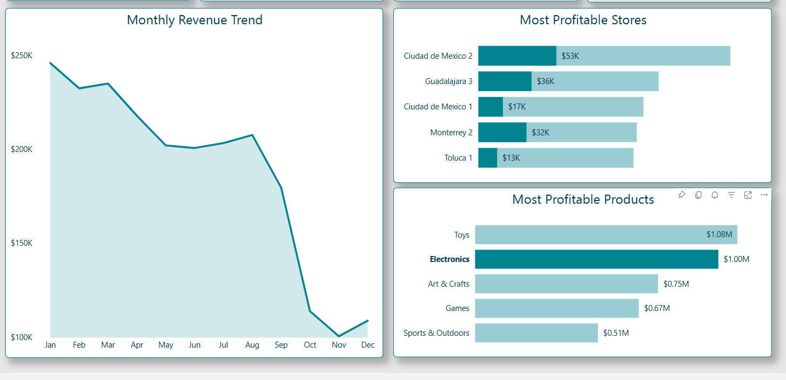
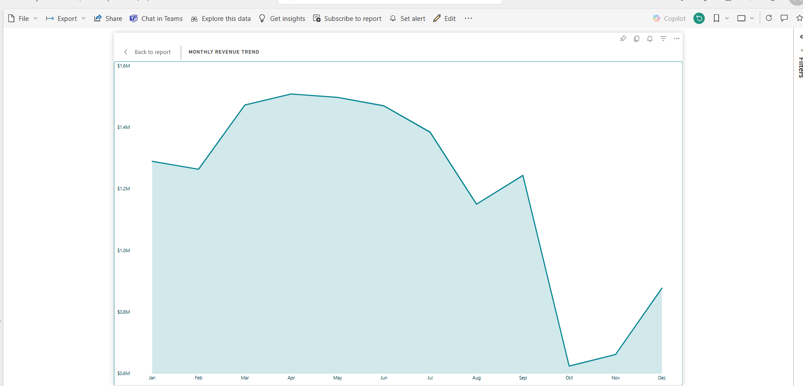
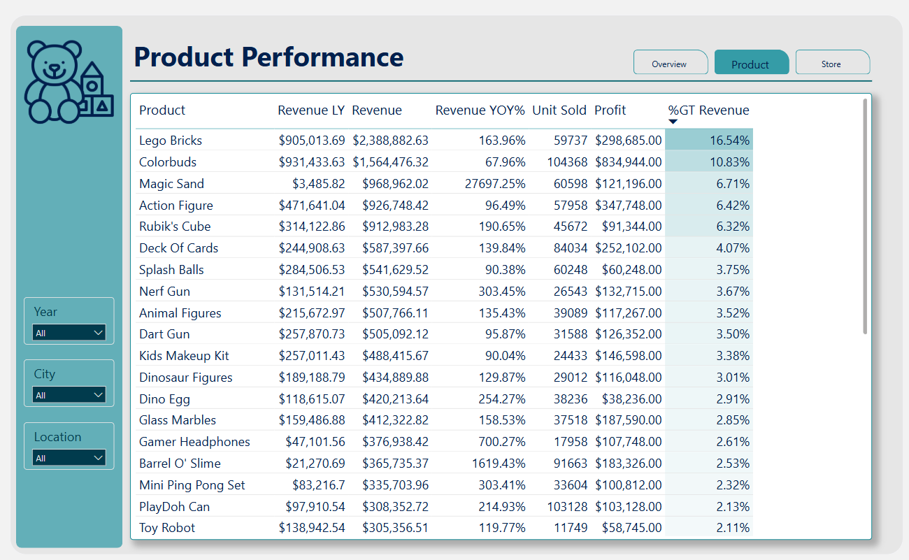
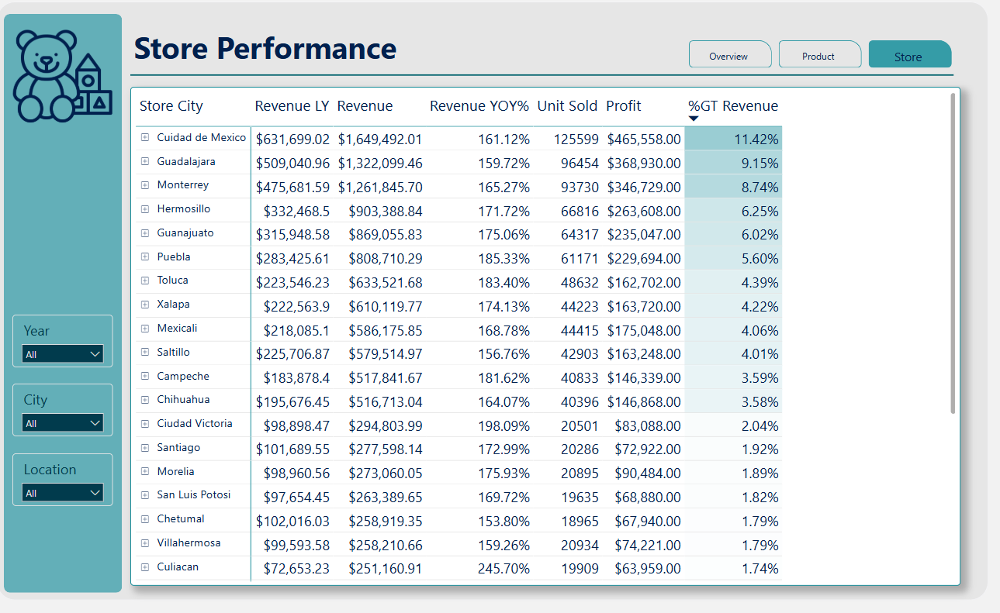

# Maven Toys Expansion and Sales Report Analysis

---
## Introduction

Maven Toys is a leading retailer in the toys and entertainment industry, offering a diverse range of products that spark creativity and joy in children and families. As the company seeks to expand its market presence, it has undertaken a data-driven approach to identify profitable opportunities and strategic locations for new stores.

The role of the BI Consultant is to analyze sales, product, and store data to uncover actionable insights. This project aims to guide Maven Toys’ expansion strategy, ensuring decisions are both impactful and aligned with business goals.

**_Disclaimer_**: _The datasets and reports used in this project are entirely fictional and do not reflect any real company, institution, or country. They have been created solely to showcase the analytical capabilities of Power BI._

## Problem Statement
Maven Toys is looking to expand its business by identifying the most profitable product categories, locations, and seasonal patterns. The challenge is to analyze existing sales data and provide actionable insights.
  1. Which product categories drive the biggest profits?
  2. Is this the same across store locations?
  3. Can you find any seasonal trends or patterns in the sales data?

## Skills / Concept Demonstrated
  - Data Preprocessing and Normalization
  - Data Modeling and Analysis
  - Seasonal Trend Analysis
  - DAX (Data Analysis Expressions)
  - Quick Measures
  - Page Navigation
  - Filters
  - Tooltips
  - Buttons
  - Refrencing

## Data Source
The dataset used for this analysis was sourced to simulate real-world business scenarios and includes comprehensive records to enable a detailed investigation. Key components of the dataset include:

  - Calendar Information: Detailed date data used for identifying seasonal sales patterns and trends.

  - Product Details: Information about categories, costs, and prices to analyze product profitability.

  - Store Data: Details about store locations, operational types, and opening dates to evaluate regional performance.

  - Sales Records: Comprehensive transaction data serving as the foundation for profitability and trend analysis.

  - Inventory Data: Stock levels and patterns to help understand supply efficiency and its impact on sales.

These datasets are constructed to provide an entire view of operational trends and opportunities, and they are fictional, created solely for the purpose of demonstrating data analysis and visualization techniques.

## Data Normalization & Modeling
To enable effective analysis and visualization, the dataset was processed and modeled using several essential steps:
  - Data Cleaning: Removed duplicates and handled missing values to ensure the data integrity.
  - Data Integration: Merged datasets including calendar, product, store, sales, and inventory information to create a unified dataset.
  - Established relationships between datasets, linked product, inventory and store information to sales data.
  - Normalization: Transformed the data into a structured format suitable for analysis, to make fields like product prices and costs numerical.
  - Extract features such as profit margins, seasonal trends, and geographic performance metrics.

###### Modeling:
  I designed a star schema with fact tables 'sales table' and dimension tables (products, stores, calendar, inventory) to optimize for Power BI visualization. Also added calculated fields for profit per unit, total profit, and year-over-year(YOY) comparisons. This organized dataset made it easier to find useful insights and create clear visuals.

Data Normalization                        |           Data Modeling
:----------------------------------------:|:----------------------------------:
               |      

## Data Analysis
I used Power BI to perform a comprehensive review of sales trends and performance, supporting Maven Toys plans for expansion. Below is an outline of some the steps taken and the calculations developed with DAX to generate meaningful insights:

- Calendar Utilization
    - The dataset included a pre-existing calendar table. DAX formula was used to create a shortened month name column for easier visualisation

          MonthNameShort = FORMAT(Calender[Date], "mmm")  
- Measures
    - Created base measures to calculate critical metrics, such as total sales, profit margins, and seasonal trends.

          1. Revenue = SUM(Sales[Total Price])
      
          2. Profit Margin = DIVIDE( [Profit],[Revenue])

- Yearly Comparison
    - To track business growth, some of measures were created

           1. Profit YOY% = DIVIDE(([Profit]-[Profit LY]),[Profit LY])
           
           2. Revenue YOY% = DIVIDE(([Revenue]-[Revenue LY]),[Revenue LY])
    
           3. Units Sold YOY% = DIVIDE(([Unit Sold]-[Unit Sold LY]),[Unit Sold LY])
       
## Visualisation
This report consist of 3 pages

  1. Overview
  2. product performance
  3. Store Performance

Explore the report and interact with its features [here](https://app.powerbi.com/view?r=eyJrIjoiZTYzNGI5OGItMzdkNy00M2RmLWI2NTItNDVhMDVlNDkwZDc0IiwidCI6ImZmMGYzZTNhLTNlNTMtNDU0Zi1iMmI1LTZjNjg3NTNiOGVlNCJ9)

## Exploratory Analysis
During the analysis, key observations and patterns were identified through detailed exploration of the dataset. This process uncovered:

1. Which product categories drive the biggest profits?

     
     
  - Toys led as the highest performing category, generating a profit of $1.08M, closely followed by Electronics at $1.00M. These categories dominate the market, highlighting key areas for strategic focus.
    
2. Is this the same across store locations?
    - Consistency Across Store Locations
  
  Toys                                      |           Electronics
  :----------------------------------------:|:----------------------------------:
                      |      
  
   - Toys consistently dominate as the most profitable category across all stores, contributing significantly to revenue with a total profit of $1.08M.
      
   - Electronics remain the second most profitable category in most locations, generating $1.00M in profit.

3. Can you find any seasonal trends or patterns in the sales data?
    

   - Seasonal Trends in Sales Data
    The sales data reveals clear seasonal patterns throughout the year:
      - Peak Performance:
        - The highest sales occur between March and July with about $1.5M, and revenue peaking in April at approximately $1.6M.
        - This suggests increased consumer activity during spring and early summer, likely driven by school holidays and warmer weather.
      - Decline in Late Summer:
        - Sales begin to decline in August, dropping significantly by September to below $0.8M, marking the lowest monthly revenue in the second half of the year.
      - Recovery in December:
        - After a steep decline in October and November, sales recover in December, reaching approximately $1.0M. This suggests holiday season purchases drived the recovery.

## Results/Findings
The analysis provided several actionable insights:

Product Performance                       |         Store Performance
:----------------------------------------:|:----------------------------------:
                |      

  - Top Product Categories:
      - Lego Bricks were the most profitable product, contributing $298,685 in profit with a 16.54% share of total revenue.
      - Colorbuds followed with a profit of $83,944, contributing 10.83% to total revenue.
        
  - Most Profitable Stores:
      - Ciudad de Mexico is the leading store, generating $465,558 in profit with 161.12% YOY revenue growth.
      - Guadalajara follows closely with $368,930 in profit and 159.72% YOY revenue growth.
      - Monterrey ranks third, contributing $346,729 in profit with a 165.27% YOY growth rate.
        
  - Product and Store Performance:
      - Lego Bricks and Colorbuds consistently perform well across high-revenue stores, making them essential inventory staples.
      - Stores in urban centers like Ciudad de Mexico and Guadalajara show strong demand for toys and electronics, while smaller cities perform moderately with opportunities in products like Sports & Outdoors.
        
  - Seasonal Trends:
      - Revenue peaks in April at $1.6M, highlighting the importance of spring and summer promotions.
      - December sales recover to $1.0M, driven by holiday demand.

## Recommendations
1. Expand High-Performing Stores:
    - Prioritize expanding operations in Ciudad de Mexico and Guadalajara, as they consistently generate the highest profits with $465,558 and $368,930, respectively.
    - Invest in marketing and operational enhancements for these regions to maintain their strong growth trajectory.
2. Focus on Best-Selling Products:
    - Ensure consistent availability of top-performing products like Lego Bricks ($298,685 profit) and Colorbuds ($83,944 profit) across all locations.
    - Tailor product offerings to meet local demands, especially in suburban areas where niche categories like Sports & Outdoors perform well.
3. Leverage Seasonal Trends:
    - Capitalize on peak sales periods in April and December with aggressive promotional campaigns.
    - Introduce targeted discounts and seasonal bundles to maximize revenue during these high-demand months.

## Conclusion
The analysis of Maven Toys’ sales and performance data has provided a comprehensive understanding of the company’s current landscape and opportunities for growth.
By leveraging the insights from this analysis, Maven Toys can implement data driven strategies to expand its market presence, optimize product offerings, and maximize profitability. A focus on high-performing stores and products, combined with strategic seasonal promotions, will ensure sustainable growth and long-term success.
